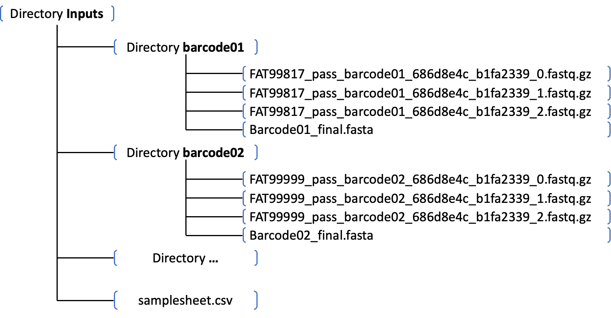

<div align="center">
<h1 align="center">Long Read Processing Pipeline</h1>
  <p align="center">A nextflow pipeline of processing long reads</p>
</div>

## Table of Contents
<details open>
<summary><b>[Show or Hide]</b></summary>

1. [Dependencies](#dependencies)
2. [File Format](#file-format)
    - [Sample sheet](#samplesheet)
    - [Structure of input directories](#structure)
3. [Usage](#usage)
    - [Run job](#runjob)
    - [Usage options](#options)
</details>

<!-- Dependencies-->
## Dependencies
samtools

minimap2

clair3

<!-- File Format-->
## File Format

<a id="samplesheet"></a>

### Sample sheet -- csv
| group | barcode_start | barcode_end | barcode_template | fastq | fasta |
| - | - | - | - | - | - |
| barcode_55 | 1200 | 1237 | NNNNATNNNNATNNNNATNNNNATNNNNATNNNNATNN | /path/of/fastq/directory/55 | /path/of/fasta/reference_55.fa |
| barcode_56 | 1200 | 1237 | NNNNATNNNNATNNNNATNNNNATNNNNATNNNNATNN | /path/of/fastq/directory/56 | /path/of/fasta/reference_56.fa | 
| barcode_57 | 1200 | 1237 | NNNNATNNNNATNNNNATNNNNATNNNNATNNNNATNN | /path/of/fastq/directory/57 | /path/of/fasta/reference_57.fa | 

<a id="structure"></a>

### Structure of input directories


<!-- Usage-->
## Usage

<a id="runjob"></a>

### Run job
submit the bash script below

```bash
#!/bin/bash
#BSUB -o %J.o
#BSUB -e %J.e
#BSUB -R "select[mem>1000] rusage[mem=1000]"
#BSUB -M 1000
#BSUB -q normal

# modules
module load HGI/common/nextflow/23.10.0
module load HGI/softpack/groups/team354/nf_longread
module load HGI/common/clair3

#--------------#
# user specify #
#--------------#
# LSF group
export LSB_DEFAULT_USERGROUP=hgi

# Paths
export INPUTSAMPLE=$PWD/inputs/samplesheet.csv
export OUTPUTRES=$PWD/outputs

#-----------#
# pipelines #
#-----------#
nextflow run -resume nf_longread/main.nf --sample_sheet $INPUTSAMPLE \
                                         --protocol DNA \
                                         --platform nanopore \
                                         --outdir $OUTPUTRES
```

<a id="options"></a>

### Usage options
```bash
nextflow run check_inputs.nf --sample_sheet "/path/of/sample/sheet"

    Mandatory arguments:
        --sample_sheet        Path of the sample sheet
    
    Optional arguments:
    Basic:
        --outdir              the directory path of output results, default: the current directory
    
    Alignment:
        --protocol            DNA, cDNA, directRNA, default: DNA
        --platform            nanopore, pacbio, hifi, default: nanopore
    
    Variant Calling:
        --model               the trainning model of variant calling, default: ont_r10
    
    Barcode Detection:
        --mapq                the mapping quality for filtering, default: 1
        --qualcut             the base quality in the barcode for filtering , default: 20
        --numcut              the number of low-quality bases in the barcode for filtering, default: 3
        --countcut            the number of reads supporting the barcode for filtering, default: 10

    Extract SNVs:
        --basequal            the base quality for filtering, default: 30
        --region              the expected region of variants, eg: 100,200, default: 0,0

    Step arguments:
        --skip_align          skip alignment
        --skip_variant        skip variant calling
        --skip_barcode        skip barcode detection
        --skip_snvcov         skip snv coverage extraction
```